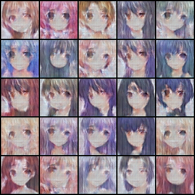
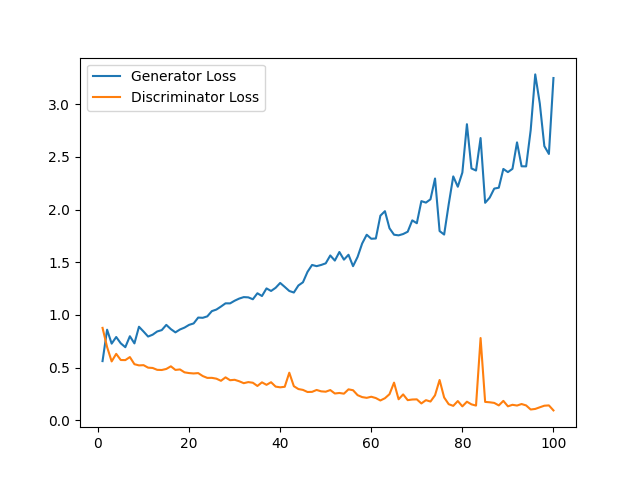
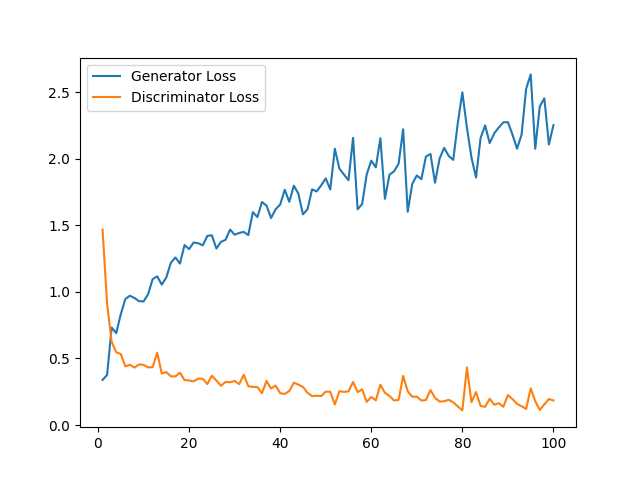
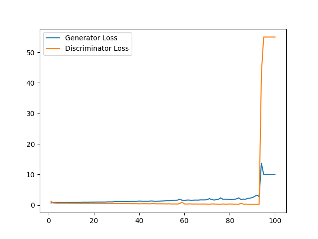
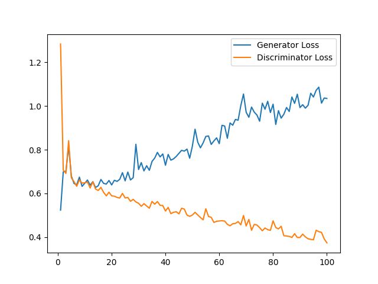
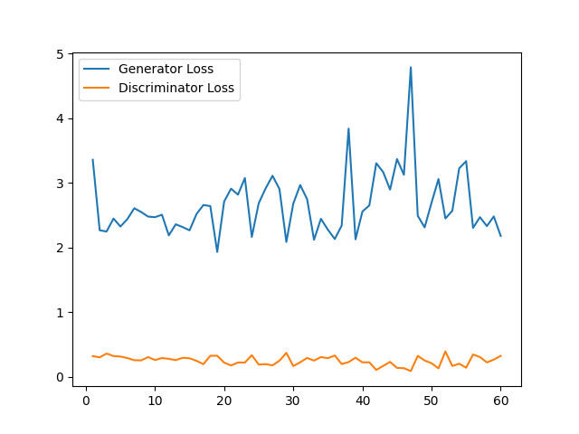

# cGAN / cDCGAN

## 实验环境

本项目基于 Windows 10 系统下的 Python 3.8 开发。所需要的环境依赖如下：

```python
matplotlib==3.5.1
numpy==1.22.0
pandas==1.3.5
Pillow==9.4.0
torch==1.11.0+cu113
torchsummary==1.5.1
torchvision==0.12.0+cu113
```

此外，若需要进行 GPU 训练，还需要安装 CUDA 计算库和 cuDNN 等。

## 数据集下载

本项目数据集来源于百度飞桨 AI Studio 公开数据集平台，包含 36,740 张 64×64 卡通人脸。此处为源数据集的 [下载地址](https://aistudio.baidu.com/aistudio/datasetdetail/82357)。

源数据集还需要进行预处理，以适应本项目的要求。为了便于使用，此处也给出预处理后的数据集的 [下载地址](https://pan.baidu.com/s/1kpuwp5O32fqxmM3qhvhF-g)，提取码为 0817。下载完成后直接解压至 `./data` 文件夹下即可。

## 运行方式

在项目的根目录下运行

```shell
python ./train.py
```

即可开始训练。以下为 `./train.py` 的命令行参数含义：

| 参数名 | 默认值 | 含义 |
| :---: | :---: | :---: |
| src | `'./data'` | 数据集保存路径 |
| sample-src | `./sample` | 生成图像样本的保存路径 |
| epochs | `100` | 训练轮次数 |
| batch-size | `512` | 批量大小 |
| glr | `1e-3` | 生成器学习率 |
| dlr | `1e-3` | 判别器学习率 |
| valid-tag | `1.0` | 真实数据标签 |
| fake-tag | `0.0` | 虚假数据标签 |
| gd-factor | `1` | 判别器迭代一轮时生成器迭代的轮数 |
| device | `'cuda'` | 训练用设备 |
| sample-num | `5` | 每轮保存图像样本的边长（例如 5 代表保存 $5^2=25$ 张图片） |
| net | `0` | 使用网络类型，0 代表 cGAN， 1 代表 cDCGAN |

训练完成后，在项目的根目录下运行

```shell
python ./draw.py
```

即可在根目录下生成 `./result.png` ，该文件为训练中的损失-迭代轮次图线。

## 实验结果

### 实际训练效果（cDCGAN，训练 60 轮）



### 损失-迭代轮次图线

cGAN：



TTUR：



标签平滑化：



调整训练轮次（`gd_factor=3`）：



cDCGAN：



